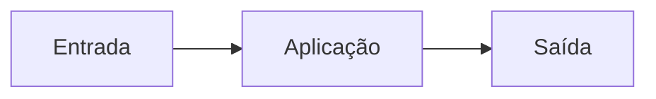
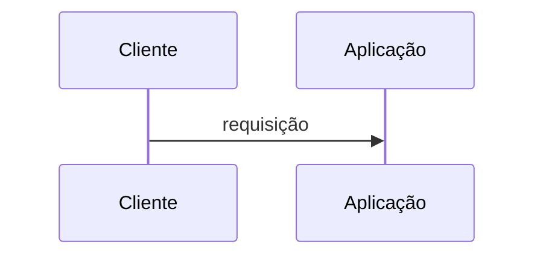

# Fluxos

<!-- specsfy:documentator:start -->
Os diagramas são exemplos de formato. Eles não representam relações confirmadas da aplicação.

## Fluxo principal

```mermaid
flowchart LR
  Entrada --> Aplicação --> Saída
```

```mermaid
sequenceDiagram
  participant Cliente
  participant Aplicação
  Cliente->>Aplicação: requisição
```
<!-- specsfy:documentator:end -->
